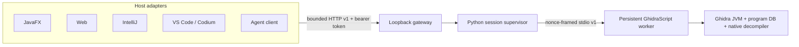
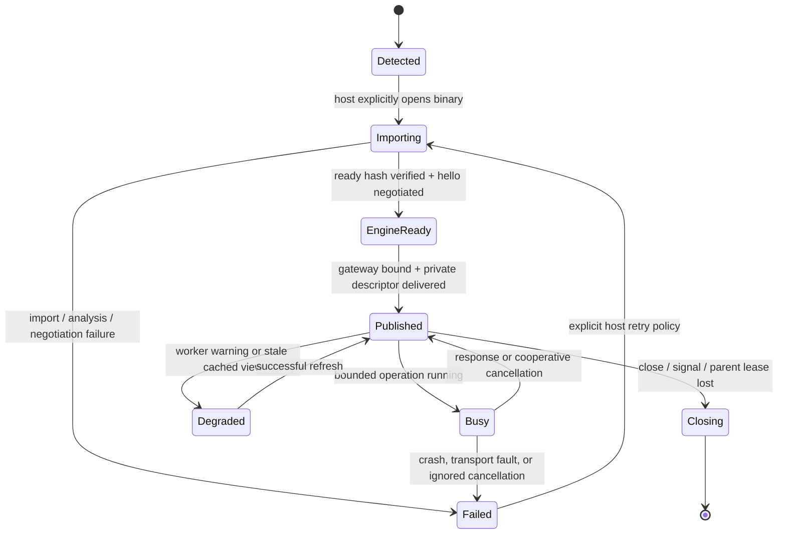

# GhidraEx engine architecture

This document is the long-term boundary for turning the UI experiments into one product. The
normative wire contract is [`integration/protocol/PROTOCOL.md`](../integration/protocol/PROTOCOL.md);
this document describes the implemented process boundary, ownership, deployment, and the next
authority-bearing subsystems.

> **Scope note:** this document is the implementation record for the immutable JSON v1 lane. The
> heavy Ghidra source audit found that mutable projects, repositories, compound workflows,
> debugging, extensions, scripts, and agents need a richer topology. The maintained
> [architecture research](research/README.md), [edge-case ledger](research/edge-case-ledger.md),
> and [proposed ADR-0002](../integration/protocol/ADR-0002-semantic-protobuf-project-runtime.md)
> define that v2 direction without rewriting v1 history.

The persistent read path is no longer only a design. A real Ghidra 12.1.2 process has been exercised
through framed stdio for program summary, listing paging, symbol search, references, decompilation,
liveness, graceful close, and temporary-project cleanup. The same real session has returned summary
data and replayed readiness through the authenticated HTTP gateway. The web workbench is the first
real host adopter; JavaFX, IntelliJ, and VS Code / Codium still use explicitly synthetic adapters.
Their retained read workflows now sit behind bounded, cancellation-aware, context-qualified async
loaders, so a real adapter no longer requires moving provider calls out of renderers as part of the
same change. It still must map v1/v2 identity, limits, lifecycle, and capability semantics; no
prototype is considered real merely because it can detect the backend.

## Product topology

The implemented unit is one gateway, one supervisor session, and one worker. The worker owns one
imported program, one temporary Ghidra project, one supported Ghidra JDK, and immutable revision `0`
in protocol v1. A host can launch more than one isolated unit; multiplexing multiple programs behind
one gateway is future work, not an implicit feature of v1.

The gateway owns HTTP authentication, Host/Origin policy, event replay, the parent lease, and the
session's final close. The Python supervisor owns launcher/JDK discovery, the temporary project,
process group, launch-input digest, stdio framing, bounded logs, request correlation, and cleanup.
The Java worker owns all Ghidra API objects and a persistent `DecompInterface`. Hosts own view state
and caches. No Ghidra object, classloader, database handle, Swing component, native decompiler
handle, binary path, or bearer token crosses the public protocol boundary.

The loopback gateway is the intended shared transport for host adapters. A host should not grow its
own Ghidra launcher or interpret Ghidra stdout. Keeping that machinery below the gateway makes
failure, cancellation, and compatibility behavior reusable across all four UIs.

## Proven read-only slice

The current worker advertises only methods it can serve. `decompile.function` is omitted if its
decompiler cannot be initialized.

| Method | Current behavior |
| --- | --- |
| `session.hello` | Protocol v1 and capability negotiation; performed by the supervisor at startup |
| `session.ping` | Bounded session liveness check |
| `session.close` | Graceful, idempotent shutdown |
| `request.cancel` | Best-effort cancellation of queued or active work |
| `program.summary` | Identity, hashes, analysis state, address bounds, and object counts |
| `listing.window` | Deterministic forward/backward code-unit pages with opaque cursors |
| `symbols.search` | Bounded deterministic symbol filtering and paging |
| `references.list` | Bounded incoming/outgoing reference pages |
| `decompile.function` | Bounded decompilation of the function containing an address |

Collections, text, HTTP messages, frame sizes, queueing, retained events, and logs all have explicit
bounds. Program reads carry `{programId, revision}`. Addresses and cursors remain opaque strings so
host runtimes cannot lose address precision or invent cursor semantics.

## Lifecycle and failure model

Detection never means connection. If a real session fails, a host may keep the last immutable real
document visibly stale, but it must not place fixture instructions under the real program identity.
Switching to the demo fixture is an explicit user action.

There is one serialized Ghidra API worker per program. A separate control reader handles
`request.cancel` while the worker is blocked. Listing, symbol, and reference work checks a
cancellable monitor between bounded items; decompilation passes the monitor to Ghidra. Startup
deadlines and shutdown deadlines terminate the child process group, and framing faults or crashes
fail pending callers. Java thread stopping is never used.

A request deadline keeps the original request ID reserved, sends an out-of-band cancel, and grants
one bounded cancellation grace period. If the terminal response arrives, the caller still receives
`DEADLINE_EXCEEDED` but the session can remain usable. If the operation or cancellation write does
not unwind, the supervisor records one canonical transport fault, wakes every pending caller,
force-terminates the process tree, closes its pipes, and removes the temporary project. Restart is
always an explicit host-policy decision.

The CLI captures its launching process's creation identity before the potentially long import and
checks it during startup and while serving. Parent exit or PID reuse closes the listener and engine.
There is no idle timeout today; lifetime is parent lease, explicit close, process signal, or owner
shutdown. The gateway replays a bounded `session.ready` event so a client connecting after the import
can bootstrap without an unversioned side channel.

## Source and ownership boundaries

| Area | Responsibility | Must not contain |
| --- | --- | --- |
| `integration/protocol` | Language-neutral envelopes, schemas, limits, errors, and conformance fixtures | Ghidra or host UI types |
| `integration/ghidra` | Official launcher discovery, batch exporter, persistent worker, process supervision, real compatibility tests | Browser or IDE APIs |
| `integration/gateway` | Authenticated loopback HTTP, parent lease, replayable events, transport backpressure | Ghidra model calls |
| `prototypes/*` | Native presentation and typed protocol adapters | Direct Ghidra class loading or stdout parsing |

Protocol v1 is deliberately read-only. Binary paths are launch inputs controlled by the supervisor,
not request parameters. Every collection and text result is bounded, addresses and cursors are
opaque strings, and every successful program read carries `{programId, revision}`.

## Security boundary

- The supervisor hashes the binary itself before launch and refuses to publish a worker whose
  `session.ready` SHA-256 does not match.
- Each stdio session has a fresh 128-bit nonce. It separates protocol frames from Ghidra output and
  rejects cross-session frames; it is not an authentication credential.
- The gateway binds literal `127.0.0.1` on an ephemeral port, requires a fresh 256-bit bearer token
  even for health, checks exact Host and allowed Origin values, disables caching, and bounds request
  resources.
- The token is transferred out of band in a new owner-only `0600` descriptor or retained in an
  embedding host's memory. It is not printed in the bootstrap record, accepted in a URL, or written
  to workspace configuration.
- The gateway validates envelopes and program context before dispatch. Engine errors are mapped to
  bounded protocol errors without relaying paths, stack traces, tokens, or binary contents.
- The gateway owns final session close, and the supervisor removes its ephemeral project on normal
  shutdown and the tested startup-failure paths.

These controls protect the local protocol boundary; they do not turn Ghidra analysis of hostile
input into a general sandbox. Strong OS sandboxing and resource isolation remain deployment work.

## Remaining read-path engineering

Before treating this slice as a production service, complete these items without widening v1's
authority:

1. Add an explicit restart state machine with retry budgets, cursor invalidation, and host-visible
   recovery rather than restarting implicitly.
2. Stream import/analysis progress from before `session.ready`; analysis currently completes before
   the persistent post-script starts.
3. Add OS resource containment and stress/fuzz coverage for hostile binaries, slow clients, and
   cancellation races.
4. Expand real compatibility CI beyond the pinned Linux Ghidra 12.1.2 lane before advertising more
   operating systems or Ghidra versions.
5. Decide whether idle expiry is a product requirement. It is deliberately absent from the current
   gateway and must be lease-aware if added.

## Authority-bearing roadmap

The sections below record the original roadmap from the v1 implementation. In particular, the raw
client-held `transaction.begin` sequence has been superseded in the v2 proposal by short,
server-owned, intent-level transactions and repository sagas. See
[protocol v2 requirements](research/protocol-v2-requirements.md) for the current design.

The following features are separate capability planes. They should extend the envelope and identity
model; they should not become an `execute arbitrary code` method.

### Mutations and undo

Add transactions before any write operation:

1. `transaction.begin` pins a base revision and declares requested capabilities.
2. Bounded mutation commands produce a preview and an audit record.
3. `transaction.commit` requires the same base revision and an idempotency key.
4. A successful commit increments the program revision and emits invalidation events.
5. Reversible database changes receive an undo journal; external effects never pretend to be
   undoable.

Conflicting or stale revisions fail rather than being merged implicitly.

### Scripting and REPL

Read-only convenience does not make arbitrary scripts safe. Script packages need a manifest,
content hash, language/runtime version, declared filesystem/process/network capabilities, quotas,
and an approval decision. Python or general-purpose Java runs in a separately sandboxed runner.
GhidraScript code that must access a `Program` is installed from an allowlisted, immutable package
and executed inside a disposable worker. Output, diagnostics, and produced changes are bounded and
provenance-tagged.

Interactive REPL state belongs to an explicit leased runner and expires with the lease. Project or
workspace configuration must never silently grant process execution.

### Debugger and trace

Debugger coordinates are a tuple—trace, snapshot, thread, frame—not just an address. Initial trace
queries can use HTTP request/response methods. A negotiated WebSocket channel may later carry
high-rate register, memory, breakpoint, and target events while retaining protocol request IDs,
sequence numbers, revisions, scopes, and cancellation. Captured-trace reads, emulator mutations,
and live-target control are distinct capabilities. Historical values always stay labeled as stale.

### Plugins and extensions

There are two plugin classes:

- Host plugins contribute native commands, editors, views, and renderers through the host's normal
  extension system.
- Engine extensions run only in isolated workers and declare compatible Ghidra/protocol ranges,
  methods, limits, native dependencies, and authority requirements.

The gateway will validate an extension manifest before worker launch. Enabling or upgrading an
engine extension will restart the affected worker; hot classloader mutation is not a compatibility
contract. Third-party extension methods use a namespaced protocol capability and ship conformance
fixtures.

### Agent clients

Agents use their own short-lived scoped credentials rather than inheriting a UI token. Read quotas,
deadlines, cancellation, and revision checks apply equally to humans and agents. Evidence records
include the program hash, revision, address range, method and engine version, input hashes, and a
fact-versus-hypothesis classification. Transactions, scripts, target control, network access, and
process execution pass through explicit approval policy.

## Compatibility and release gates

Current automated gates are:

- dependency-free protocol schema, envelope, framing, and security-contract tests;
- deterministic fake-worker tests for startup, negotiation, malformed/foreign frames, cooperative
  cancellation, ignored-cancel process teardown, concurrent fault propagation, size limits, and
  cleanup;
- injected-session gateway tests for authentication, Host/Origin rules, context validation, replay
  gaps, saturation, private metadata, parent identity loss, and owned shutdown; and
- a pinned official Ghidra 12.1.2 lane that runs batch determinism plus real persistent summary,
  listing paging, symbol, reference, decompiler, gateway, and cleanup assertions.

Planned release gates include recorded protocol fixtures in every host, real-platform compatibility
lanes, and fuzzing of frame decoding, JSON depth/duplicates, cursors, address handling, and HTTP
limits before any write or scripting capability ships. Adding a Ghidra
version means adding a compatibility-matrix lane, not silently widening a version string.

Protocol-compatible additions may add advertised methods and events. Breaking envelope or semantic
changes receive a new major framing prefix and HTTP path so old and new hosts can coexist during an
upgrade.
