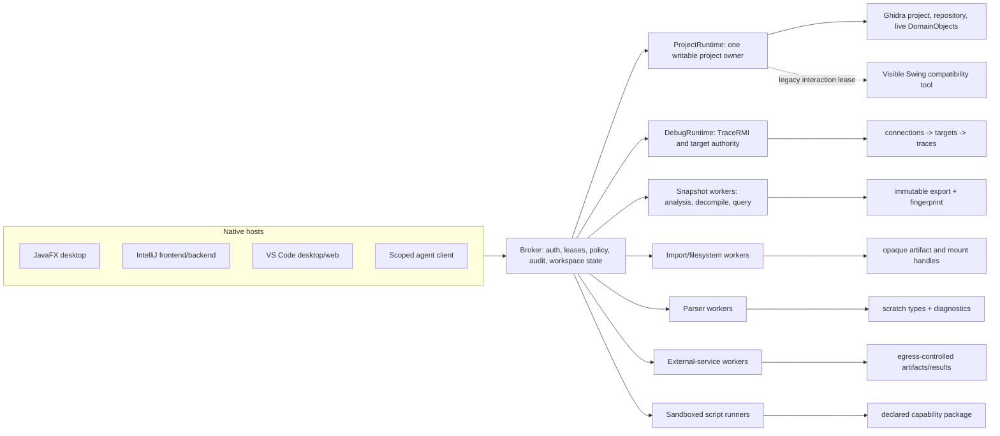

# Runtime topology and state ownership

## Decision summary

The mutable backend is a supervised set of runtimes, not one universal server process and not one
Ghidra JVM embedded into every host. The unit that may open a writable project is:

```text
ProjectRuntimeKey = {
  tenant_or_local_user,
  repository_server_and_name,
  repository_identity,
  local_project_identity,
  exact_ghidra_build,
  extension_set_digest
}
```

Exactly one `ProjectRuntime` owns a key and its `.rep` directory. This follows Ghidra's project
locking, process-global active-project state, repository credential/cache behavior, live-object
consumer lifetimes, and shared transaction managers. See [`ProjectManager`](https://github.com/NationalSecurityAgency/ghidra/blob/Ghidra_12.1.2_build/Ghidra/Framework/Project/src/main/java/ghidra/framework/model/ProjectManager.java),
[`DefaultProjectData`](https://github.com/NationalSecurityAgency/ghidra/blob/Ghidra_12.1.2_build/Ghidra/Framework/Project/src/main/java/ghidra/framework/data/DefaultProjectData.java),
[`AppInfo`](https://github.com/NationalSecurityAgency/ghidra/blob/Ghidra_12.1.2_build/Ghidra/Framework/Project/src/main/java/ghidra/framework/main/AppInfo.java),
and [`ClientUtil`](https://github.com/NationalSecurityAgency/ghidra/blob/Ghidra_12.1.2_build/Ghidra/Framework/FileSystem/src/main/java/ghidra/framework/client/ClientUtil.java).

## Process graph



The broker is deliberately independent of Ghidra project state. It owns authentication, client
leases, policy, operation journals, audit records, host workspace/layout state, and immutable
artifact metadata. A corrupt or headless Ghidra tool state must not erase these records.

## Runtime responsibilities

| Runtime | Owns | Concurrency rule | Failure boundary |
| --- | --- | --- | --- |
| Broker | sessions, scoped credentials, policy, journals, event log, workspace state | concurrent, durable ordering by resource epoch | restart without opening Ghidra storage |
| `ProjectRuntime` | project lock, repository identity, live domain objects, recovery choices, VT/merge jobs | serialize mutations per `DomainObject`; coordinate project/repository sagas separately | recycle only after closing consumers and reconciling outcomes |
| Snapshot worker | one immutable input manifest and derived results | bounded task pool; no writable project sharing | disposable and retryable when operation is idempotent |
| Import/filesystem worker | loader probe, nested mounts, encrypted/container inputs, staged import outputs | principal-isolated and bounded; explicit candidate/recipe | kill and discard staging, mounts, plaintext and cache partition |
| Parser worker | C/header or other parser environment and scratch datatype manager | serial disposable lane while parser uses JVM globals | discard scratch types and private temp directory on any failure |
| External-service worker | symbol/BSim/artifact source credentials, egress policy and download cache | separately credentialed per principal/provider | close connection; quarantine partial/unverified output |
| Decompiler lane | bounded pool of one-request-at-a-time native decompiler processes | never share one `DecompInterface` concurrently | cancel or native fault may recycle lane/JVM |
| `DebugRuntime` | TraceRMI connections, target/trace graph, control mode, trace transactions | FIFO commands per connection; explicit authority per mutation | disconnect creates a new epoch; lost control replies are indeterminate |
| Script runner | immutable package, interpreter state, declared capabilities, quotas | leased per user/task; Ghidra writes delegated as semantic proposals | killable sandbox; never shares host/JVM authority |
| Legacy UI | one Swing tool and modal interaction owner | one interaction lease; AWT/Swing rules apply | close/recreate without making it a hidden server dependency |

## State planes

State that appears adjacent in a UI is often stored and transacted independently in Ghidra. The
broker must keep the planes explicit.

| Plane | Examples | Canonical owner |
| --- | --- | --- |
| Shared program content | memory, instructions, symbols, functions, shared comments | `ProjectRuntime` domain object |
| Repository state | checkout base/latest, versions, ACLs, remote paths | repository plus operation journal |
| Private Ghidra user data | `ProgramUserData`, private properties | per-user project runtime |
| Recovery state | crash recovery generations and user decision | `SafeOpen` coordinator |
| Host workspace state | splits, tabs, pinned documents, navigation history | broker/host workspace store |
| Derived state | decompile result, graphs, searches, analysis reports | revision-bound result arena |
| Debug trace state | snaps, schedules, trace objects, breakpoints | `DebugRuntime` |
| Live target state | registers, memory, execution, live breakpoints | target through explicit control authority |
| Audit/provenance | proposals, approvals, evidence, mutations, artifacts | append-only broker store |

Import, parsing, and external artifact access are separate from a generic snapshot pool. Loader
discovery invokes extension code without a `TaskMonitor`; encrypted filesystem passwords are held
in process-global caches; C header parsing temporarily redirects JVM-wide `System.out` and commits
its datatype transaction even after some parse failures. These behaviors demand disposable,
principal-partitioned workers and scratch-then-publish workflows rather than concurrent calls in a
shared project JVM.

`Project.save()` is not a substitute for the workspace store. In headless `DefaultProject`, it
returns without saving tool state when no `ToolManager` exists; GUI state restore also has broad
failure deletion behavior ([`DefaultProject`](https://github.com/NationalSecurityAgency/ghidra/blob/Ghidra_12.1.2_build/Ghidra/Framework/Project/src/main/java/ghidra/framework/project/DefaultProject.java)).

## Ownership and leases

- Clients receive opaque leases, never Java object handles. A lease records runtime epoch,
  resource ID, authority, and expiry.
- Opening a `DomainObject` adds a broker consumer. Disconnect cleanup releases that consumer only
  after active operations reach a safe point.
- A compound workflow declares all members before its first write. Adding or removing members from
  a Ghidra synchronized transaction group clears undo/redo for every member
  ([`SynchronizedTransactionManager`](https://github.com/NationalSecurityAgency/ghidra/blob/Ghidra_12.1.2_build/Ghidra/Framework/Project/src/main/java/ghidra/framework/data/SynchronizedTransactionManager.java)).
- VT is a fixed compound lease over at least the session and destination program. Merge owns its
  original, latest, checked-out, and result programs for the complete job.
- Runtime restart, repository reconnect, extension change, language migration, identity repair,
  and debug reconnect each advance a distinct epoch and invalidate affected leases.

## Mutation and consistency model

Ghidra `DomainObject` subtransactions are not independent nested transactions. They share rollback
fate, and undo/restore can replace the entire object state. Therefore clients submit an operation
intent; the server performs validation and opens the shortest possible Ghidra transaction.

1. Resolve durable references and compare expected epochs/generations.
2. Compute a non-mutating preview, including secondary effects and required authority.
3. Return the preview for approval without holding a transaction or project lock.
4. Re-resolve and revalidate immediately before execution.
5. Open a named server-owned transaction, apply the approved intent, validate postconditions, and
   commit or roll back.
6. Advance the content generation, invalidate derived results, append the audit record, and publish
   ordered events.

Repository operations do not fit this transaction. Check-in, checkout, move, and multi-file
operations have remote and local stages, can partially succeed, and may lose replies. They are
durable sagas with per-stage outcomes and postcondition reconciliation, including
`OUTCOME_UNKNOWN`.

## Safe open and maintenance jobs

All domain-object opens route through `SafeOpen`. `okToRecover=false` can delete recovery data, and
compound objects such as VT sessions can open additional programs as a side effect
([`DomainFile`](https://github.com/NationalSecurityAgency/ghidra/blob/Ghidra_12.1.2_build/Ghidra/Framework/Project/src/main/java/ghidra/framework/model/DomainFile.java),
[`VTSessionDB`](https://github.com/NationalSecurityAgency/ghidra/blob/Ghidra_12.1.2_build/Ghidra/Features/VersionTracking/src/main/java/ghidra/feature/vt/api/db/VTSessionDB.java)).

`SafeOpen` first discovers the dependency graph and reports recovery, checkout, schema-upgrade,
content-handler, language, compiler-spec, and extension requirements. The caller must choose one
of `RECOVER`, `DISCARD_RECOVERY`, `OPEN_READ_ONLY`, or `ABORT` for every affected object before any
destructive open occurs.

Project conversion, repository reassociation, storage migration, language/compiler migration,
archive restore, and extension-set changes are maintenance jobs. Each requires preflight, backup or
export, a durable journal, explicit downtime, progress/cancellation semantics, and recovery
instructions. They are never ordinary editor commands.

## Read isolation

Three read modes are useful and must be visible in results:

| Mode | Guarantee | Use |
| --- | --- | --- |
| `LIVE` | may observe a changing program; result reports start/end generations | responsive UI queries |
| `STABLE_OBJECT` | excludes mutations on the live object for the bounded operation | short semantic reads |
| `IMMUTABLE_SNAPSHOT` | derived from a content-addressed export and engine fingerprint | agents, reproducible reports, bulk analysis |

Decompiler callbacks read the live `Program`; a mutation during a decompile can produce a
mixed-generation answer. `CONSISTENT` decompilation therefore uses mutation exclusion or an
immutable snapshot. Every derived result records both input generation and completeness.

## Deployment shapes

- **Local desktop:** host launches a per-user broker. Ghidra runtimes remain on the same machine,
  authenticated over owner-only local transport. UI JDK/Node versions remain independent of
  Ghidra's JDK.
- **JetBrains Remote Development:** broker and `ProjectRuntime` live on the backend side near the
  repository/project. The thin client receives semantic DTOs only.
- **VS Code desktop or remote extension host:** connect from the workspace-side extension host.
  Do not assume the UI machine can see binary paths or Ghidra installations.
- **VS Code web:** always connects to a broker over an authenticated remote endpoint. A web worker
  cannot spawn Ghidra, access arbitrary local files, or use Node extension APIs.
- **Multi-user service:** one OS/container security boundary per untrusted tenant or repository
  identity. JVM separation alone is not a sandbox for hostile binaries, scripts, or extensions.

## Legacy compatibility surface

Some Ghidra APIs accept or return Swing components, launch arbitrary modal dialogs, or require the
interactive merge tool. Initial completeness therefore needs a visible, controlled Swing tool.
Only one client may hold its interaction lease; the broker reports `LEGACY_UI_REQUIRED` instead of
waiting forever for a hidden dialog. The compatibility surface receives typed launch context and
returns a typed outcome. Its existence must not let new semantic APIs depend on scraping Swing
widgets.
